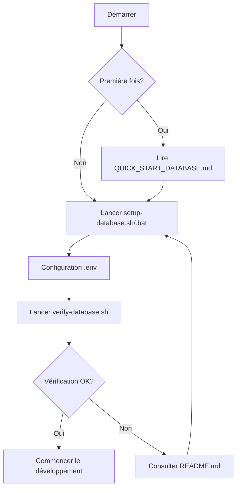

# 📚 Index des Fichiers de Base de Données

## 📁 Structure des Fichiers

```
database/
├── 📄 schema.sql                    [19 KB] - Script SQL complet (424 lignes)
├── 🔧 setup-database.sh             [3.6 KB] - Installation automatique Linux/macOS
├── 🔧 setup-database.bat            [2.9 KB] - Installation automatique Windows
├── ✅ verify-database.sh            [5.5 KB] - Vérification de l'installation
├── 📖 README.md                     [7.0 KB] - Guide complet d'utilisation
├── ⚙️  .env.database.example        [2.0 KB] - Exemple de configuration
└── 📋 INDEX.md                           - Ce fichier

Racine du projet/
├── 🚀 QUICK_START_DATABASE.md       [2.6 KB] - Guide de démarrage rapide
└── 📚 DATABASE_SCHEMA_DOCUMENTATION.md [31 KB] - Documentation complète du schéma
```

---

## 📄 Description des Fichiers

### 🎯 Fichiers Principaux

| Fichier | Taille | Description | Usage |
|---------|--------|-------------|-------|
| **schema.sql** | 19 KB | Script SQL complet pour créer les 18 tables | Import direct dans MySQL |
| **setup-database.sh** | 3.6 KB | Script d'installation automatique Bash | Linux/macOS/WSL |
| **setup-database.bat** | 2.9 KB | Script d'installation automatique Batch | Windows CMD |
| **verify-database.sh** | 5.5 KB | Vérification et statistiques de la DB | Après installation |

### 📖 Documentation

| Fichier | Taille | Description | Audience |
|---------|--------|-------------|----------|
| **README.md** | 7.0 KB | Guide complet avec toutes les méthodes d'installation | Développeurs |
| **QUICK_START_DATABASE.md** | 2.6 KB | Guide rapide en 3 étapes | Débutants |
| **DATABASE_SCHEMA_DOCUMENTATION.md** | 31 KB | Documentation technique complète du schéma | Architectes/DevOps |
| **.env.database.example** | 2.0 KB | Exemples de configuration Laravel | Tous |

---

## 🚀 Quelle Option Choisir ?

### Vous êtes débutant ?
→ Lisez [QUICK_START_DATABASE.md](../QUICK_START_DATABASE.md)

### Vous voulez une installation automatique ?
- **Linux/macOS** : Exécutez `setup-database.sh`
- **Windows** : Double-cliquez sur `setup-database.bat`

### Vous préférez le manuel ?
→ Suivez le guide dans [README.md](README.md)

### Vous avez besoin des détails techniques ?
→ Consultez [DATABASE_SCHEMA_DOCUMENTATION.md](../DATABASE_SCHEMA_DOCUMENTATION.md)

### Vous voulez vérifier l'installation ?
→ Lancez `verify-database.sh`

---

## 📊 Contenu du Schéma (schema.sql)

### Tables Créées (18 au total)

#### 👥 Authentification & Utilisateurs
- `users` - Comptes avec rôles (admin/vendeur/client)
- `password_reset_tokens` - Réinitialisation de mots de passe
- `sessions` - Sessions actives

#### 🛍️ Catalogue & Produits
- `categories` - Catégories de produits
- `products` - Produits avec infos nutritionnelles
- `product_variants` - Variantes couleur/taille
- `product_weight_variants` - Variantes poids (prix/stock)

#### 🛒 Commerce
- `cart_items` - Paniers d'achat
- `orders` - Commandes
- `order_status_history` - Historique des statuts
- `delivery_fees` - Frais de livraison

#### 💰 Financier
- `invoices` - Factures avec TVA (19%)
- `notifications` - Notifications système

#### 🔧 Système
- `cache` & `cache_locks` - Cache Laravel
- `jobs`, `job_batches`, `failed_jobs` - Files d'attente
- `site_settings` - Configuration du site

### Caractéristiques Techniques

| Métrique | Valeur |
|----------|--------|
| **Tables** | 18 |
| **Colonnes** | 200+ |
| **Foreign Keys** | 30+ |
| **Indexes** | 40+ |
| **Lignes SQL** | 424 |
| **Moteur** | InnoDB |
| **Charset** | utf8mb4 |
| **Collation** | utf8mb4_unicode_ci |

---

## 🔄 Flux d'Utilisation Recommandé



---

## 💡 Commandes Rapides

### Installation Complète (Une ligne)
```bash
# Linux/macOS
./database/setup-database.sh bsissa root mot_de_passe && ./database/verify-database.sh bsissa root mot_de_passe

# Windows
database\setup-database.bat bsissa root mot_de_passe

# MySQL Direct
mysql -u root -p -e "CREATE DATABASE IF NOT EXISTS bsissa CHARACTER SET utf8mb4 COLLATE utf8mb4_unicode_ci;" && mysql -u root -p bsissa < database/schema.sql
```

### Vérification Rapide
```bash
# Compter les tables (doit afficher 18)
mysql -u root -p bsissa -e "SHOW TABLES;" | wc -l

# Avec le script de vérification
./database/verify-database.sh bsissa root mot_de_passe
```

### Réinitialisation Complète
```bash
# Supprimer et recréer
mysql -u root -p -e "DROP DATABASE IF EXISTS bsissa; CREATE DATABASE bsissa CHARACTER SET utf8mb4 COLLATE utf8mb4_unicode_ci;"
mysql -u root -p bsissa < database/schema.sql
```

---

## 📞 Ressources & Support

### Documentation
- **Guide Débutant** : [../QUICK_START_DATABASE.md](../QUICK_START_DATABASE.md)
- **Guide Complet** : [README.md](README.md)
- **Référence Technique** : [../DATABASE_SCHEMA_DOCUMENTATION.md](../DATABASE_SCHEMA_DOCUMENTATION.md)

### Scripts
- **Installation** : `setup-database.sh` (Linux/macOS) ou `setup-database.bat` (Windows)
- **Vérification** : `verify-database.sh`
- **Configuration** : `.env.database.example`

### Fichiers Source
- **Schéma SQL** : `schema.sql` (424 lignes, 18 tables)

---

## 📝 Historique des Versions

| Version | Date | Description |
|---------|------|-------------|
| 1.0 | 16 Nov 2025 | Version initiale - 18 tables, documentation complète |

---

**Note** : Tous les scripts sont testés et prêts à l'emploi. Pour toute question, consultez d'abord la documentation appropriée ci-dessus.
